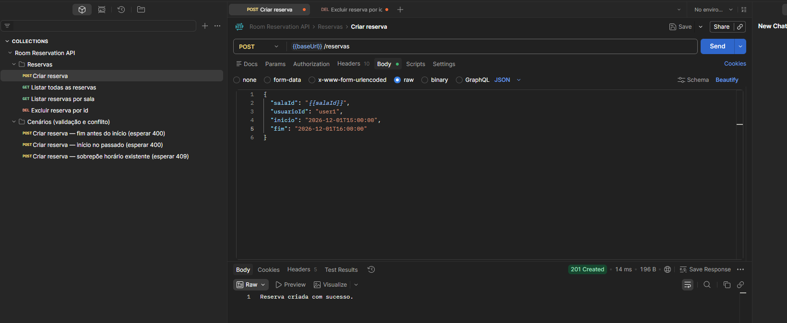
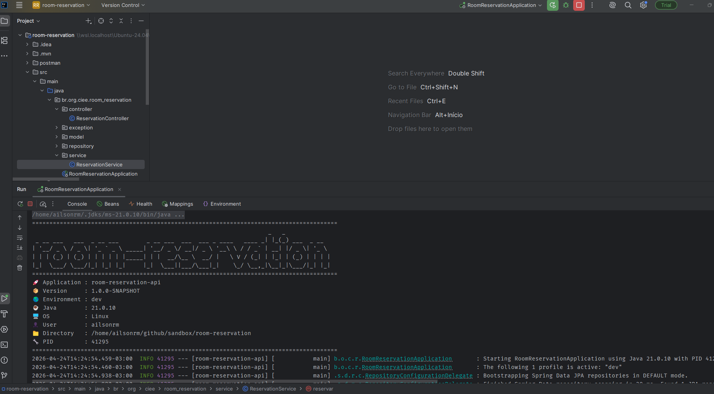
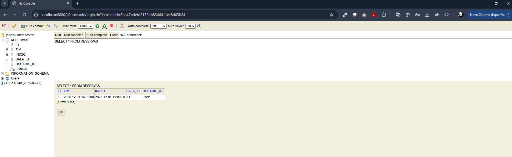

# 🏢 Room Reservation API

> REST API para gerenciamento de reservas de salas de reunião, com validação de regras de negócio e prevenção de conflitos de agenda.





---

## 🚀 Sobre o projeto

Esta API foi desenvolvida utilizando **Java + Spring Boot**, com foco em:

- ✔️ Boas práticas de arquitetura (Controller → Service → Repository)
- ✔️ Validação robusta de regras de negócio
- ✔️ Prevenção de conflitos de horários
- ✔️ Código limpo e organizado
- ✔️ Facilidade de execução (H2 em memória)

---

## 🧠 Regras de negócio implementadas

- ⏰ O horário de início deve ser anterior ao horário de fim  
- 📅 Reservas devem ser feitas apenas para o futuro  
- 🚫 Não é permitido conflito de horários na mesma sala  

### 🔥 Regra de conflito

```java
inicio.isBefore(existente.getFim()) &&
fim.isAfter(existente.getInicio())
```

---

## 🛠️ Tecnologias utilizadas

- ☕ Java 17+
- 🚀 Spring Boot
- 🌐 Spring Web
- 🗄️ Spring Data JPA
- ⚡ H2 Database (em memória)
- 🔧 Lombok

---

## 📡 Endpoints da API

### ➕ Criar reserva

POST /reservas

#### 📥 Body

```json
{
  "salaId": "A1",
  "usuarioId": "user1",
  "inicio": "2026-04-25T10:00:00",
  "fim": "2026-04-25T11:00:00"
}
```

---

### 📄 Listar todas reservas

GET /reservas

---

### 📄 Listar por sala

GET /reservas/{salaId}

---

### ❌ Excluir reserva

DELETE /reservas/{id}

---

## ⚙️ Como executar o projeto

### 🔧 Pré-requisitos

- Java 17+
- Maven

---

### ▶️ Rodando a aplicação

```bash
mvn spring-boot:run
```

ou

```bash
./mvnw spring-boot:run
```

---

### 🌐 Acesso

http://localhost:8080

---

### 🗄️ Console H2

http://localhost:8080/h2-console

Configuração:

- JDBC URL: jdbc:h2:mem:testdb
- User: sa
- Password: (vazio)

---

## 🧱 Estrutura do projeto

src/main/java/br/org/ciee/room_reservation
 ├── controller
 ├── service
 ├── repository
 ├── model
 ├── exception
 └── RoomReservationApplication

---

## 🧪 Exemplos de cenários

✔️ Criar reserva válida → sucesso  
❌ Criar reserva no passado → erro  
❌ Criar reserva com conflito → rejeitado  
❌ Intervalo inválido (início > fim) → erro  

---

## 🧠 Decisões técnicas

- Uso do H2 para facilitar testes e execução rápida  
- Validações centralizadas no Service  
- API REST simples e objetiva  
- Separação clara de responsabilidades  

---

## 📌 Diferenciais

- ✔️ Tratamento de erros consistente  
- ✔️ Regra de conflito bem definida  
- ✔️ Código limpo e legível  
- ✔️ Estrutura pronta para evolução (microservices / cloud)

---

## 👨‍💻 Autor

**Ailson Ramos Moreira**

- 💼 Java Backend Developer / Tech Lead
- 🚀 Foco em arquitetura, APIs e sistemas escaláveis

---
